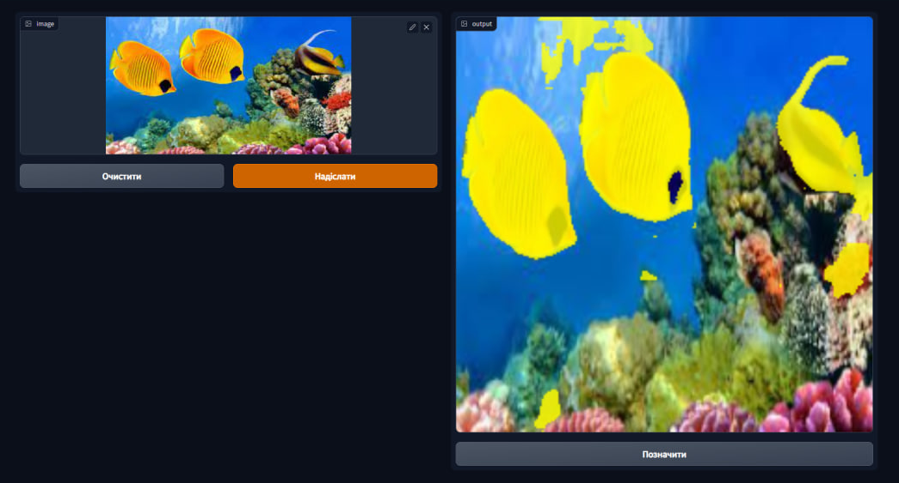

# Fish segmentation

A fish segmentation pet-project.
U-Net and pretrained DINOv2 architectures were tested.

Tech stack:
 - DVC for experiment tracking
 - pytorch
 - pytorch lightning
 - Albumentations
 - Gradio


## Dataset
[SUIM](https://irvlab.cs.umn.edu/resources/suim-dataset) Dataset.


For this project only fish masks were sampled.

964 Train-val datapoints were randomly sampled in 80% to 20% ratio.
Test dataset containes 66 annotated images.

Additionaly 10% images without fish were added to train, val and test splits.


### Augmentations
Train-val set was augmentated using [Albumentations](https://albumentations.ai/) library:
 - ShiftScaleRotate
 - RGBShift
 - RandomBrightnessContrast
 - HorizontalFlip

## Results
The best model was U-Net with IOU 0.598 on test dataset.


## Demo
Demo can be accessed running 

```
python scr\demo.py
```


